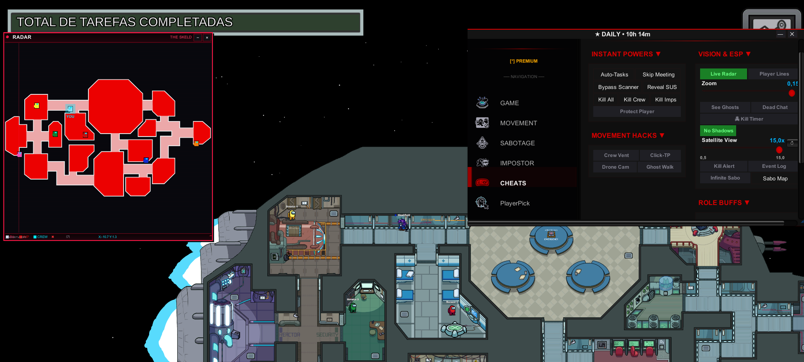
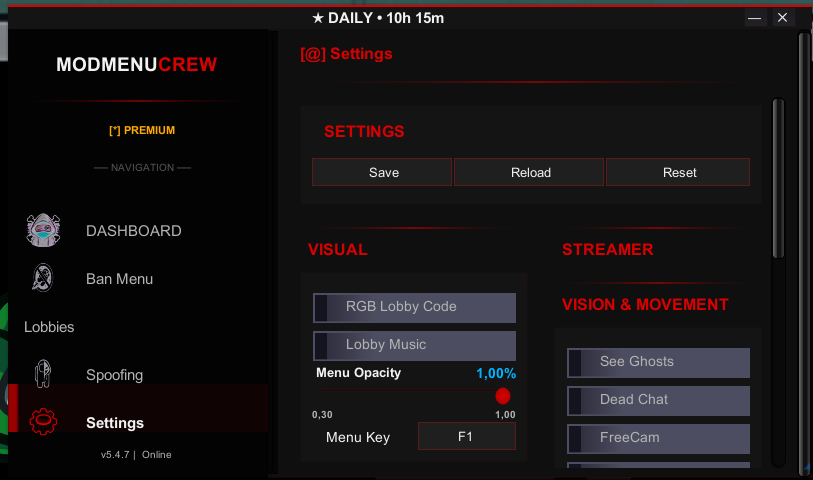

<p align="center">
  
</p>

<h1 align="center">🎮 ModMenuCrew v5.4.7</h1>

<p align="center">
  <b>The Most Advanced Among Us Mod Menu | Hack | Cheat | 2025</b>
</p>

<p align="center">
  <a href="https://dotnet.microsoft.com/"></a>
  <a href="https://builds.bepinex.dev/projects/bepinex_be"></a>
  <a href="https://store.steampowered.com/app/945360/Among_Us/"></a>
  <a href="#compatibility"></a>
  <a href="https://crewcore.online"></a>
  <a href="https://discord.gg/PwKxjszxaa"></a>
</p>

<p align="center">
  <a href="https://crewcore.online"></a>
</p>

---

## 📖 About ModMenuCrew

**ModMenuCrew** is a powerful and feature-rich **mod menu** for **Among Us**, designed for content creators, streamers, private lobbies, and testing purposes. This **Among Us hack** provides users with complete control over game mechanics, including **role manipulation**, **teleportation**, **speed boost**, **noclip**, **god mode**, and much more.

Built with **BepInEx IL2CPP** and **Harmony**, this **Among Us cheat** is compatible with the latest **2025 versions** of the game and offers a clean, modern UI that any player can use.

> **🔥 100% Undetected | Works on Among Us 2025 | Free & Premium Options**

---

## ⚠️ Important Notice - Open Source Showcase

> **⚠️ ATTENTION:** This repository contains **only a showcase/demo version** of the ModMenuCrew source code for educational and demonstration purposes.

### 📦 This Open Source Contains:
- Partial source code for learning purposes
- Basic structure and architecture examples
- UI/UX design references
- Documentation and guides

### 🚀 Full Version Available:
The **complete, fully-functional ModMenuCrew** with all features, updates, and support is available exclusively at:

<p align="center">
  <a href="https://crewcore.online">
    
  </a>
</p>

| Full Version Includes | |
|:----------------------|:---|
| ✅ All features unlocked | ✅ Regular updates |
| ✅ Premium support | ✅ HWID protection |
| ✅ Anti-detection | ✅ New features first |

<p align="center">
  
  
  
</p>

<p align="center">
  <b>🎉 Join 110+ active subscribers who trust and support ModMenuCrew!</b>
  <br/>
  <sub>Our growing community receives priority support, exclusive updates, and helps shape future features.</sub>
</p>

---

## 🖼️ Screenshots & Showcase

<p align="center">
  
</p>

<p align="center">
  <b>📋 Complete Feature List - Every Hack Available</b>
</p>

---

<p align="center">
  
</p>

<p align="center">
  <b>🎨 Modern & Clean Menu Interface - Easy to Use</b>
</p>

---

<p align="center">
  
</p>

<p align="center">
  <b>🔑 Premium License System - Fast Activation</b>
</p>

---

## 🚀 Quick Navigation

| 🎯 Section | 📌 Link |
|:---:|:---:|
| 🎮 **Features** | [View All Features](#-all-features) |
| 📥 **Download** | [Installation Guide](#-installation) |
| 🔑 **Activation** | [Key System](#-key-system--activation) |
| ⭐ **Premium** | [Premium Plans](#-premium-plans) |
| 🛡️ **Security** | [Anti-Detection](#%EF%B8%8F-security--anti-detection) |
| ❓ **FAQ** | [Frequently Asked Questions](#-faq) |
| 💬 **Support** | [Discord Server](https://discord.gg/PwKxjszxaa) |
| 🌐 **Website** | [crewcore.online](https://crewcore.online) |

---

## ⚡ All Features

### 🎭 Role Control & Manipulation
| Feature | Description |
|:--------|:------------|
| **Role Assignment** | Assign any role to any player before match starts (Impostor, Crewmate, Shapeshifter, Engineer, Scientist, Tracker, Guardian Angel) |
| **Force Impostor** | Guarantee impostor role for yourself or others |
| **Live Role Switch** | Change roles during an active match |
| **Role Reveal** | See every player's true role at any time |
| **Role Desync Fix** | Fix Unity synchronization issues |

### 🏃 Movement & Teleportation Hacks
| Feature | Description |
|:--------|:------------|
| **Speed Hack** | Adjustable speed multiplier (1x - 10x) |
| **Teleport to Players** | Instantly teleport to any player's location |
| **Click Teleport** | Teleport to any point by clicking on the map |
| **Noclip / Walk Through Walls** | Move through any obstacle or wall |
| **Fly Hack** | Move freely in any direction |

### 👁️ Vision & ESP
| Feature | Description |
|:--------|:------------|
| **Full Brightness** | Remove darkness, see everything |
| **Unlimited Vision** | Maximum vision range always active |
| **Player ESP** | See all players through walls |
| **Role ESP** | See impostor/crewmate indicators |
| **Radar System** | Mini-map showing all player positions |

### 💀 Impostor Cheats
| Feature | Description |
|:--------|:------------|
| **No Kill Cooldown** | Instant kill, no waiting |
| **Kill Anyone** | Kill any player regardless of distance |
| **Kill All** | Eliminate all crewmates instantly |
| **Mass Kill** | Kill multiple players at once |
| **Instant Vent** | Faster vent animations |
| **Vent Walk** | Stay in vent while moving |

### 🔧 Sabotage Controls
| Feature | Description |
|:--------|:------------|
| **Instant Sabotage** | Trigger any sabotage instantly |
| **No Sabotage Cooldown** | Continuous sabotage capability |
| **Fix Sabotages** | Repair any sabotage immediately |
| **Door Control** | Close/open any door at will |

### ✅ Task & Game Cheats
| Feature | Description |
|:--------|:------------|
| **Complete All Tasks** | Finish all tasks instantly |
| **Fake Tasks** | Appear to do tasks without completing them |
| **Task Counter** | See real-time task progress |
| **End Meeting** | Force close meetings instantly |
| **Skip Vote** | Force skip voting phase |

### 🔄 Role-Specific Enhancements
| Role | Cheats Available |
|:-----|:-----------------|
| **Shapeshifter** | Infinite shapeshift duration, no cooldown, instant transform |
| **Engineer** | Unlimited vent time, no vent cooldown |
| **Scientist** | Infinite vitals battery, always see vitals |
| **Tracker** | No tracking cooldown, track multiple players |
| **Guardian Angel** | Instant protect, no cooldown |

### 🏠 Lobby & Host Tools
| Feature | Description |
|:--------|:------------|
| **Lobby Browser** | Find and list all public lobbies |
| **Player List** | View all players with detailed info |
| **Kick/Ban Players** | Remove unwanted players |
| **Timed Bans** | Ban players for specific durations |
| **Auto-Extend Countdown** | Keep lobby open automatically |
| **Game Settings Control** | Modify any game setting on the fly |

### 🎨 UI & Quality of Life
| Feature | Description |
|:--------|:------------|
| **Draggable Menu** | Press **F1** to toggle the mod menu |
| **Tabbed Interface** | Clean organization of all features |
| **Premium Status Display** | Shows remaining premium time |
| **Custom Themes** | Multiple visual themes available |
| **Streamer Mode** | Hide sensitive info for streaming |

---

## 📥 Installation

### 📋 Requirements
- **Among Us** (Steam) - v2025.11.18 or newer
- **BepInEx 6.0.0-be.735** (IL2CPP version)
- **Windows 10/11**
- **.NET 6.0 Runtime**

### 📖 Step-by-Step Guide

#### Step 1: Download BepInEx
1. Go to [BepInEx Bleeding Edge Builds](https://builds.bepinex.dev/projects/bepinex_be)
2. Download **BepInEx IL2CPP for Windows x64**
3. Extract to your Among Us folder (where `Among Us.exe` is located)

#### Step 2: Initialize BepInEx
1. Run Among Us once
2. Wait for game to load to menu
3. Close the game
4. BepInEx folders should now exist in your game folder

#### Step 3: Download ModMenuCrew
1. Visit [crewcore.online](https://crewcore.online) OR
2. Join our [Discord](https://discord.gg/PwKxjszxaa)
3. Download the latest `ModMenuCrew.dll`

#### Step 4: Install the Mod
1. Navigate to: `Among Us\BepInEx\plugins\`
2. Create a folder called `ModMenuCrew`
3. Place `ModMenuCrew.dll` inside that folder
4. Final path should be: `Among Us\BepInEx\plugins\ModMenuCrew\ModMenuCrew.dll`

#### Step 5: Activate & Play
1. Launch Among Us
2. Press **F1** to open the mod menu
3. Enter your activation key (get one at [crewcore.online](https://crewcore.online))
4. Enjoy all features!

### ✅ Verify Installation
Check BepInEx console for:
```
[Info   :   BepInEx] Loading [ModMenuCrew 5.4.7]
Plugin com.crewmod.oficial version 5.4.7 is loading.
```

---

## 🔑 Key System & Activation

ModMenuCrew uses a **key-based activation system** for access control and premium features.

### 🔄 How to Get a Key

1. **Visit** [crewcore.online](https://crewcore.online)
2. **Login** with your Discord account
3. **Join** our Discord server (required)
4. **Generate** your activation key
5. **Copy** the key and paste in-game

### 📋 Key Types

| Type | Duration | Features |
|:-----|:---------|:---------|
| **Free** | Single Session | All features while game is open |
| **48 Hours** | 48 hours | All features, reusable, no shortener ads |
| **7 Days** | 7 days | All features, extended access |
| **30 Days** | 30 days | All features, priority support |
| **90 Days** | 90 days | All features, best value |
| **365 Days** | 1 year | All features, annual savings |
| **Lifetime** | Forever | Permanent access, all future updates |

### 🔒 Key Format
- **Free Keys:** `XXXX-XXXX-XXXX-XXXX`
- **Premium Keys:** `P-XXXX-XXXX-XXXX-XXXX`

---

## ⭐ Premium Plans

### 🆓 Free vs 💎 Premium - What's the difference?

| Aspect | 🆓 Free | 💎 Premium |
|:-------|:--------|:-----------|
| **Key Generation** | Via **Linkvertise** shortener (ads) | **Direct** - No ads, instant key |
| **Key Duration** | **Single session** - New key every time you open the game | **Persistent** - Same key until license expires |
| **Convenience** | Must complete shortener every session | One-time activation, play anytime |
| **Features** | ✅ All features | ✅ All features |
| **Support** | Community Discord | ⭐ Priority support |

> **📌 Note:** Free users have access to **ALL the same features** as premium users! The only difference is the convenience - free users need to generate a new key via Linkvertise every time they open the game, while premium users receive a persistent key that works until their license expiration date.

---

### 💰 Premium Pricing

| Plan | 💵 Price (USD) | ⏱️ Duration | 📊 Value |
|:-----|:---------------|:-------------|:---------|
| **48 Hours** | **$0.74** | 2 days | Quick access |
| **7 Days** | **$1.84** | 7 days | Weekly access |
| **30 Days** | **$4.61** | 30 days | Monthly access |
| **90 Days** | **$11.07** | 90 days | Quarterly access |
| **365 Days** | **$27.68** | 1 year | ⭐ Best Value (~$2.50/month) |
| **Lifetime** 🎁 | **$55.35** | Forever | 👑 Ultimate - Pay once, use forever |

---

### 💎 Premium Benefits
- ✅ **Skip Linkvertise** - No more ad shorteners, generate keys instantly
- ✅ **Persistent Key** - Your key works until license expiration (no daily regeneration)
- ✅ **Unlimited Sessions** - Open/close the game as many times as you want
- ✅ **All Features Unlocked** - 100% feature access (same as free)
- ✅ **Priority Support** - Faster Discord support response
- ✅ **Early Access** - New features before public release
- ✅ **HWID Protection** - Key secured to your hardware (see below)
- ✅ **Auto Updates** - Automatic compatibility updates

---

### 🔐 HWID Security (Hardware ID Protection)

Premium licenses use **HWID (Hardware ID) binding** for enhanced security:

| Feature | Description |
|:--------|:------------|
| **What is HWID?** | A unique identifier generated from your computer's hardware components |
| **Why we collect it?** | To bind your premium key exclusively to your device |
| **Security benefit** | Prevents key sharing/piracy - your key only works on YOUR computer |
| **Privacy** | HWID is anonymized and used ONLY for license verification |
| **Protection** | If someone steals your key, it won't work on their device |

> **🔒 Your HWID is collected ONLY when activating a premium license.** This ensures that your premium key cannot be shared or stolen. It's a security feature that protects YOUR investment.

**🛒 Purchase:** [crewcore.online](https://crewcore.online) → Login → Select Plan → Pay via Stripe

---

## 🛡️ Security & Anti-Detection

ModMenuCrew is protected with **enterprise-grade security** to ensure safety and prevent unauthorized distribution.

### 🔐 Protection Layers
| Protection | Description |
|:-----------|:------------|
| **HWID Binding** | Keys locked to your hardware |
| **IP Verification** | Additional security layer |
| **Rate Limiting** | 20 requests/minute per IP |
| **HMAC Signatures** | Tamper-proof responses |
| **Turnstile CAPTCHA** | Human verification on generation |
| **Code Obfuscation** | Protected source code |
| **Anti-Debug** | Development tool detection |

### ✅ Safety Status
- ✅ **Undetected** by Among Us anti-cheat (none exists)
- ✅ **Safe** for Steam accounts
- ⚠️ **Use responsibly** in private lobbies only

---

## ⚙️ Configuration

Settings file location: `BepInEx\config\com.crewmod.oficial.cfg`

| Setting | Description | Default |
|:--------|:------------|:--------|
| `ShowLobbyCountdown` | Display countdown timer | `true` |
| `AutoExtendThreshold` | Auto-extend when players < X | `3` |
| `StreamerMode` | Hide lobby code | `false` |
| `MenuHotkey` | Key to open menu | `F1` |
| `EnableSounds` | Menu sound effects | `true` |

---

## 📊 Compatibility

| Component | Version | Status |
|:----------|:--------|:-------|
| **Among Us** | 2025.11.18+ | ✅ Fully Compatible |
| **BepInEx** | 6.0.0-be.735 IL2CPP | ✅ Required |
| **.NET** | 6.0 | ✅ Required |
| **Windows** | 10/11 | ✅ Supported |
| **Linux** | - | ⚠️ Wine/Proton Only |
| **macOS** | - | ❌ Not Supported |
| **Mobile** | - | ❌ Not Supported |
| **Console** | - | ❌ Not Supported |

---

## ❓ FAQ

<details>
<summary><b>🔧 The mod doesn't load - what should I do?</b></summary>

- Make sure you're using **BepInEx 6 IL2CPP** (not the Unity Mono version)
- Verify the DLL is in `BepInEx\plugins\ModMenuCrew\ModMenuCrew.dll`
- Run the game once with just BepInEx installed first
- Check BepInEx console for error messages

</details>

<details>
<summary><b>🔑 My key says "Invalid format"</b></summary>

- Keys must be 19-23 characters
- Format: `XXXX-XXXX-XXXX-XXXX` or `P-XXXX-XXXX-XXXX-XXXX`
- Make sure you copied the entire key without extra spaces

</details>

<details>
<summary><b>🔒 Can I share my premium key with friends?</b></summary>

No. Premium keys are bound to your **hardware ID (HWID)**. They will not work on other computers.

</details>

<details>
<summary><b>🌐 Does this work in public lobbies?</b></summary>

Technically yes, but **please don't use it in public lobbies**. Use only in private lobbies with consenting friends for testing or content creation.

</details>

<details>
<summary><b>🚫 Will I get VAC banned or game banned?</b></summary>

- Among Us does **NOT** have VAC or any anti-cheat
- Innersloth may ban accounts for reports of cheating
- Using features disruptively in public can get you **lobby banned**
- Steam account remains **safe**

</details>

<details>
<summary><b>⚡ Some features aren't working!</b></summary>

- Many features require **host privileges**
- Make sure you're the **lobby host**
- Check if the feature is compatible with your current game version

</details>

<details>
<summary><b>🔄 How do I update the mod?</b></summary>

1. Download the latest `ModMenuCrew.dll`
2. Replace the old DLL in `BepInEx\plugins\ModMenuCrew\`
3. Your key will still work (premium keys)

</details>

---

## 🛠️ Build from Source

<details>
<summary>Click to expand build instructions</summary>

### Requirements
- .NET SDK 6.x
- Visual Studio 2022 or `dotnet` CLI
- Among Us game files (for IL2CPP headers)

### Build Steps
```powershell
# Clone the repository
git clone https://github.com/MRLuke956/ModMenuCrew.git
cd ModMenuCrew

# Restore dependencies
dotnet restore

# Build release version
dotnet build -c Release
```

### Output Location
`ModMenuCrew\bin\Release\net6.0\ModMenuCrew.dll`

</details>

---

## ⚖️ Legal Disclaimer

- **For educational and private lobby use only**
- Do **NOT** use in public, ranked, or competitive matches
- Respect other players and game developers
- All rights reserved - redistribution requires explicit permission
- By using this software, you accept all responsibility for its use

---

## 💖 Credits

- **BepInEx Team** — IL2CPP Plugin Framework
- **HarmonyX** — Runtime Patching System
- **Innersloth** — Among Us Developers
- **Community** — Testing, Feedback, Support

---

## 🔍 SEO Tags & Keywords

<details>
<summary>📌 Click to expand all SEO keywords</summary>

### 🎯 Primary Keywords
`among us mod menu` `among us hack` `among us cheat` `among us mod` `among us hacks` `among us cheats` `among us mod menu 2025` `among us hack 2025` `among us cheat 2025` `among us hacker` `among us modded` `among us trainer`

### 🌍 Multi-Language Keywords
`among us hack español` `among us hack português` `among us mod русский` `among us hack 日本語` `among us mod français` `among us hack deutsch` `hack para among us` `trucos among us` `trapacear among us`

### 🎮 Feature Keywords
`among us god mode` `among us speed hack` `among us teleport hack` `among us noclip` `among us wall hack` `among us kill cooldown hack` `among us impostor hack` `among us role hack` `among us always impostor` `among us instant kill` `among us fly hack` `among us esp` `among us radar` `among us see through walls` `among us complete all tasks` `among us task hack` `among us sabotage hack` `among us vent hack` `among us unlimited vision` `among us full brightness` `among us no fog`

### 💀 Impostor Keywords
`among us impostor mod menu` `among us force impostor` `among us always be impostor` `among us impostor cheat` `among us impostor hack 2025` `among us kill anyone` `among us mass kill` `among us kill all` `among us no kill cooldown`

### 🔧 Technical Keywords
`among us bepinex mod` `among us il2cpp hack` `among us dll mod` `among us plugin hack` `among us harmony patch` `among us net6 mod` `among us modding 2025` `among us mod loader` `among us injector`

### 📥 Download Keywords
`among us mod menu download` `among us hack download` `among us cheat download` `among us mod download free` `among us hack free download` `download among us mod menu` `baixar mod menu among us` `descargar hack among us` `among us mod menu pc download` `among us hack pc 2025`

### 🔑 Access Keywords
`among us mod menu free` `among us hack free` `among us cheat free` `among us mod menu gratis` `among us hack grátis` `among us free hack 2025` `among us working mod menu` `among us undetected hack` `among us safe cheat` `among us legit hack`

### 🖥️ Platform Keywords
`among us pc hack` `among us steam hack` `among us pc mod menu` `among us steam mod menu` `among us windows hack` `among us desktop cheat` `among us pc cheat 2025`

### 🏷️ Alternative Names
`amog us hack` `amogus mod menu` `amogus hack` `sus mod menu` `among us sus hack` `crewmate hack` `impostor hack among us` `among us external hack` `among us internal hack` `among us menu hack`

### 📺 Content Creator Keywords
`among us troll mod` `among us funny mod` `among us streamer mod` `among us youtuber tools` `among us content creator mod` `among us private lobby tools` `among us testing tools` `among us host tools`

### 🔥 Trending Keywords 2025
`among us mod menu 2025 working` `among us hack 2025 updated` `among us cheat 2025 undetected` `among us mod menu december 2025` `among us latest hack` `among us new mod menu` `among us updated hack` `among us working cheat 2025`

### 🇧🇷 Portuguese (Brazil) Keywords
`among us hack brasileiro` `among us mod menu brasil` `among us trapaca` `hack among us atualizado` `mod menu among us 2025` `among us cheat pt-br` `among us hack funciona` `baixar hack among us` `among us mod menu grátis` `among us hack sem vírus` `among us impostor hack br` `among us teleporte hack` `among us velocidade hack` `among us visão hack` `among us tarefas completas`

### 🇪🇸 Spanish Keywords
`among us hack español` `among us mod menu español` `among us trucos` `hack among us actualizado` `mod menu among us gratis` `among us trampas` `descargar hack among us` `among us hack funcionando` `among us sin hack detectado`

### 🔗 Related Searches
`crewcore` `crewcore online` `modmenucrew` `crew mod` `among us utility mod` `among us qol mod` `among us quality of life` `among us lobby tools` `among us admin tools` `among us debug tools`

</details>

---

<p align="center">
  <b>🎮 "Stay sus, but keep it classy." 🎮</b>
  <br/><br/>
  Made with ❤️ by the <b>ModMenuCrew Team</b>
  <br/><br/>
  <a href="https://crewcore.online">🌐 crewcore.online</a> • 
  <a href="https://discord.gg/PwKxjszxaa">💬 Discord</a>
</p>

---

<p align="center">
  <sub>
    among us mod menu | among us hack | among us cheat | among us hacks 2025 | among us mod menu download | among us hack download | among us cheat download free | among us impostor hack | among us always impostor | among us speed hack | among us teleport | among us noclip | among us god mode | among us wall hack | among us esp hack | crewcore | modmenucrew
  </sub>
</p>
