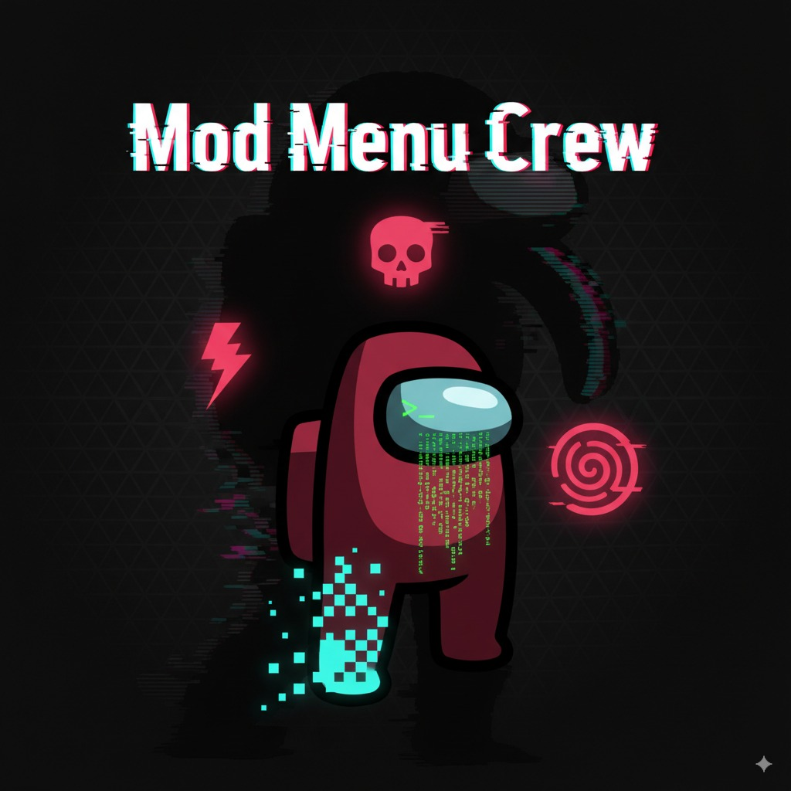

<p align="center">
  
</p>

# ModMenuCrew v5.4.7

[](https://dotnet.microsoft.com/) [-00B4CC?logo=csharp&logoColor=white)](https://builds.bepinex.dev/projects/bepinex_be) [](https://store.steampowered.com/app/945360/Among_Us/) [](#compatibility-matrix) [](https://crewcore.online) [](https://discord.gg/PwKxjszxaa)

Make your lobbies unforgettable. **ModMenuCrew** is a BepInEx IL2CPP plugin for Among Us that gives hosts and content creators precision role control, quality-of-life toggles, and a powerful host toolbox for private sessions, testing, and content creation.

— Built for .NET 6, powered by Harmony. Protected by industry-grade obfuscation.

<br/>

## 🚀 Quick Links

| | |
|---|---|
| 🎮 [Features](#-feature-overview) | 📥 [Installation](#-installation) |
| 🔑 [Key System](#-key-system) | ⭐ [Premium](#-premium-plans) |
| 🛡️ [Security](#-security--protection) | ❓ [FAQ](#-faq) |
| 🌐 [Website](https://crewcore.online) | 💬 [Discord](https://discord.gg/PwKxjszxaa) |

<br/>

## ⭐ Feature Overview

### 🎭 Role Control
| Feature | Description |
|---------|-------------|
| **Pre-assign Roles** | Set roles in lobby before match starts (Impostor, Shapeshifter, Engineer, Scientist, Tracker) |
| **Live Role Switch** | Change roles mid-match (host privileges) |
| **Role Desync Fix** | Local fix for Unity role synchronization issues |

### 🎮 Host Toolbox
| Feature | Description |
|---------|-------------|
| **Quick Actions** | Complete all tasks, close meeting, reveal roles |
| **Mass Actions** | Eliminate all, eliminate crew only, eliminate impostors only |
| **Movement** | Speed multiplier, noclip, teleport to players/cursor |
| **Vision** | Enhanced visibility, increased vision range |
| **Sabotage** | Instant sabotage controls |

### ⚡ Role-Specific Enhancements
| Role | Features |
|------|----------|
| **Shapeshifter** | Endless shapeshift, no cooldown |
| **Engineer** | Unlimited vent time |
| **Scientist** | Infinite vitals battery |
| **Tracker** | No tracking cooldown |
| **Impostor** | No cooldown, instant actions |

### 🏠 Lobby & Host Tools
- Smart lobby insights with player count
- Auto-extend countdown (configurable)
- Ban management with timed bans
- Player kick/ban interface

### 🎨 UI & Effects
- Draggable toolbox menu (press **F1** to toggle)
- Clean tabbed interface (Ban Menu, Tools, Movement, Sabotage, Impostor)
- Premium status display with remaining time
- Subtle HUD effects with CRT/glitch flourishes

<br/>

## 🔑 Key System

ModMenuCrew uses a **key-based activation system** for access control.

### How It Works:
1. **Visit** [crewcore.online](https://crewcore.online)
2. **Login** with Discord (must join our server)
3. **Generate** your activation key (free or premium)
4. **Open** Among Us → Press **F1** → Paste key
5. **Enjoy** the plugin!

### Key Types:
| Type | Duration | Features |
|------|----------|----------|
| **Standard (Free)** | While game is open | All features, single session |
| **Daily** | 48 hours | All features, reusable, no shortener |
| **Monthly** | 30 days | All features, reusable, priority support |
| **Lifetime** | Forever | All features, permanent access |

<br/>

## ⭐ Premium Plans

Skip the verification and unlock the full potential!

| Plan | Price (BRL) | Price (USD) | Duration |
|------|-------------|-------------|----------|
| **48 Horas** | R$ 3,99 | $0.79 | 2 days |
| **Mensal** | R$ 24,99 | $4.99 | 30 days |

### Premium Benefits:
- ✅ **No shortener verification** - Instant key generation
- ✅ **Unlimited key uses** - Same key works until expiration
- ✅ **All features unlocked** - Full access to every tool
- ✅ **Priority support** - Faster Discord support
- ✅ **Early access** - New features before public release
- ✅ **HWID Binding** - Key protected to your hardware

**Purchase:** [crewcore.online](https://crewcore.online) → Login → Select Plan → Pay via Stripe

<br/>

## 📥 Installation

### Requirements:
- Among Us (Steam) - v2025.11.18 or newer
- BepInEx 6.0.0-be.735 (IL2CPP)
- Windows 10/11

### Steps:
1. **Download BepInEx** from [Bleeding Edge builds](https://builds.bepinex.dev/projects/bepinex_be)
2. **Extract** to your Among Us folder
3. **Run** the game once to generate BepInEx folders
4. **Download** `ModMenuCrew.dll` from our [Discord](https://discord.gg/PwKxjszxaa) or [Website](https://crewcore.online)
5. **Place** the DLL in: `Among Us\BepInEx\plugins\ModMenuCrew\ModMenuCrew.dll`
6. **Launch** the game and press **F1** to open the toolbox

### Verify Installation:
Look for this in the BepInEx console:
```
Plugin com.crewmod.oficial version 5.4.6 is loading.
```

<br/>

## 🛡️ Security & Protection

ModMenuCrew uses **17 layers of protection** to prevent piracy and unauthorized access:

### Server-Side Protection:
| Layer | Description |
|-------|-------------|
| 🔗 HWID Binding | Keys locked to hardware ID |
| 📍 IP Verification | Fallback binding for older keys |
| ⏱️ Rate Limiting | 20 requests/minute per IP |
| 🔏 HMAC Signatures | Responses signed to prevent tampering |
| 🛡️ Turnstile CAPTCHA | Human verification on key generation |

<br/>

## 🎮 How to Use (In-Game)

1. **Press F1** to open/close the host toolbox
2. Navigate using the **tabs**:
   - **Ban Menu** - Lobby management, player bans
   - **Tools** - Quick actions, task completion
   - **Movement** - Speed, teleport, noclip
   - **Sabotage** - Sabotage controls
   - **Impostor** - Impostor-specific tools

3. **Key Features:**
   - Click players in list to select them
   - Use dropdowns to assign roles
   - Toggle features with checkboxes
   - Adjust sliders for values (speed, vision)

> ⚠️ **Note:** Some features require host privileges. Use responsibly in private lobbies only.

<br/>

## 🛠️ Build from Source

### Requirements:
- .NET SDK 6.x
- Visual Studio 2022 or `dotnet` CLI
- Among Us game files (for IL2CPP headers)

### Steps:
```powershell
# Clone the repository
git clone https://github.com/MRLuke956/ModMenuCrew.git
cd ModMenuCrew

# Restore dependencies
dotnet restore

# Build release
dotnet build -c Release
```

### Output:
`ModMenuCrew\bin\Release\net6.0\ModMenuCrew.dll`

<br/>

## ⚙️ Configuration

Settings stored in: `BepInEx\config\com.crewmod.oficial.cfg`

| Setting | Description | Default |
|---------|-------------|---------|
| `ShowLobbyCountdown` | Display countdown in lobby | true |
| `AutoExtendThreshold` | Auto-extend when players < X | 3 |
| `StreamerMode` | Hide lobby code | false |

<br/>

## 📊 Compatibility Matrix

| Component | Version | Status |
|-----------|---------|--------|
| Among Us | 2025.11.18 (17.1.0) | ✅ Tested |
| BepInEx | 6.0.0-be.735 (IL2CPP) | ✅ Recommended |
| .NET | 6.0 | ✅ Required |
| Windows | 10/11 | ✅ Supported |
| Linux/Mac | - | ❌ Not Supported |
| Console/Mobile | - | ❌ Not Supported |

<br/>

## ❓ FAQ

**Q: The plugin doesn't load!**
> Make sure you're using BepInEx 6 IL2CPP, not the older Unity Mono version. Place the DLL in `BepInEx\plugins\`.

**Q: My key says "Invalid format"**
> Keys must be 19-23 characters (format: `XXXX-XXXX-XXXX-XXXX` or `P-XXXX-XXXX-XXXX-XXXX` for premium).

**Q: Can I share my premium key?**
> No. Premium keys are bound to your hardware ID (HWID). They won't work on other devices.

**Q: Does this work in public lobbies?**
> Technically yes, but **please don't**. Use only in private lobbies with friends who consent.

**Q: Will I get banned?**
> InnerSloth doesn't have client-side anti-cheat, but using features in public can get you reported and banned from specific lobbies.

**Q: The features aren't working!**
> Some features require host privileges. Make sure you're the lobby host.

<br/>

## 🤝 Contributing

We welcome contributions! Please:
- Keep PRs focused and well-scoped
- Describe user-facing impact clearly
- Favor readability over cleverness
- Test thoroughly before submitting

### Development Tips:
- Use `.WrapToIl2Cpp()` for coroutines
- Share styles via `GuiStyles`
- Keep Harmony patches minimal

<br/>

## ⚠️ Legal & Ethics

- **For educational and private lobby use only**
- Do **NOT** use in public/ranked/competitive environments
- Respect other players and game developers
- All rights reserved - redistribution requires permission

By using this plugin, you agree to use it responsibly and accept all consequences.

<br/>

## 💖 Credits

- **HarmonyX, BepInEx, IL2CPP Interop** — Foundational tech
- **InnerSloth** — Among Us developers
- **Community** — Feedback and support

---

<br/>

## 🔍 SEO & Keywords

<details>
<summary>Click to expand SEO keywords</summary>

### Primary Keywords
`among us mod` `among us plugin` `among us bepinex` `among us host tools` `among us role control` `among us 2025` `among us pc mod` `among us steam mod`

### Long-tail Keywords
`among us bepinex il2cpp plugin` `among us role assignment tool` `among us host utilities` `among us private lobby tools` `among us content creator mod` `among us testing tools` `among us developer plugin`

### Feature Keywords
`among us teleport` `among us speed boost` `among us noclip` `among us vision range` `among us complete tasks` `among us sabotage control` `among us shapeshifter unlimited` `among us engineer vent` `among us scientist vitals`

### Technical Keywords
`bepinex 6 among us` `harmony among us` `il2cpp among us mod` `net6 among us plugin` `among us dll mod` `among us modding 2025`

### Localized Keywords (Portuguese)
`among us mod pc` `among us modificado` `among us ferramentas host` `among us controle de cargo` `among us plugin 2025` `among us teleporte` `among us velocidade` `among us visão` `among us tarefas completas`

### Related Searches
`crewcore` `crewcore online` `modmenucrew` `among us utility mod` `among us qol mod` `among us quality of life` `among us lobby tools` `among us streamer tools`

</details>

---

<p align="center">
  <b>"Stay sus, but keep it classy."</b>
  <br/><br/>
  Made with ❤️ by the ModMenuCrew Team
  <br/>
  <a href="https://crewcore.online">🌐 crewcore.online</a> • 
  <a href="https://discord.gg/PwKxjszxaa">💬 Discord</a>
</p>
